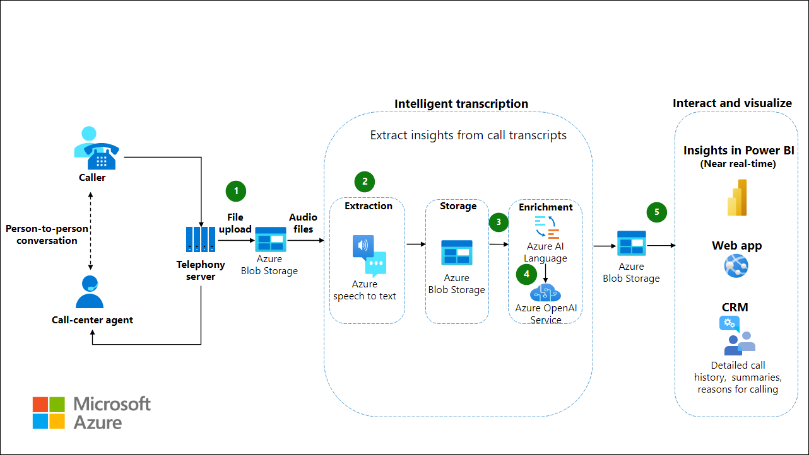
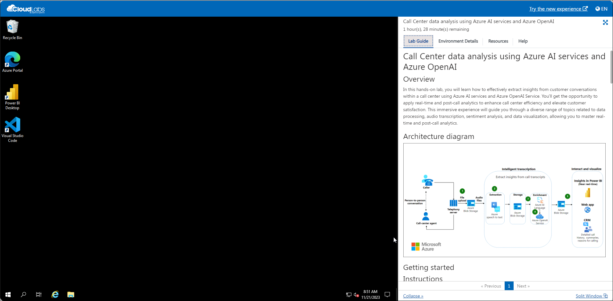
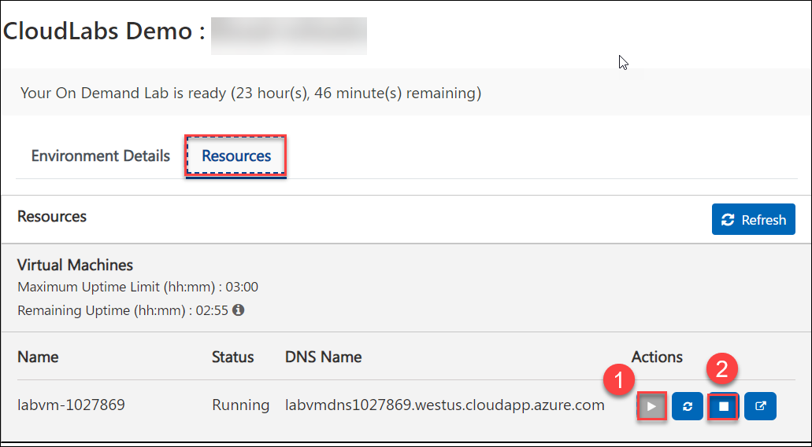
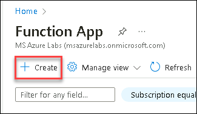
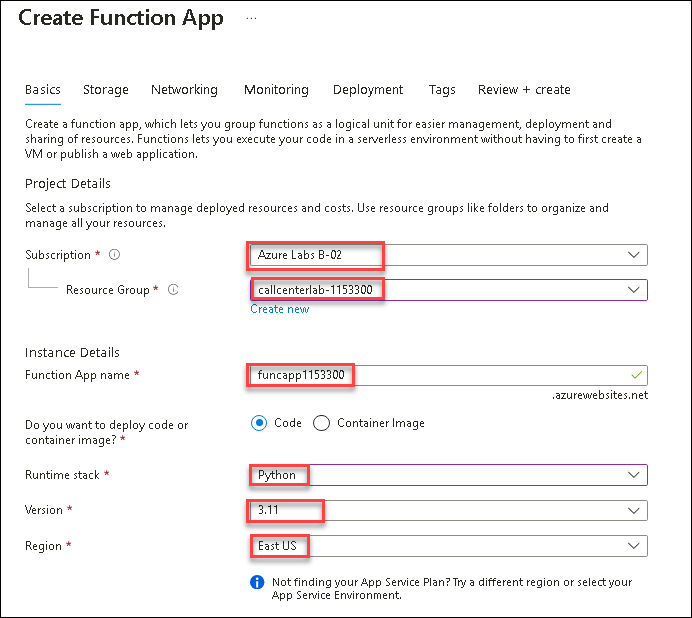
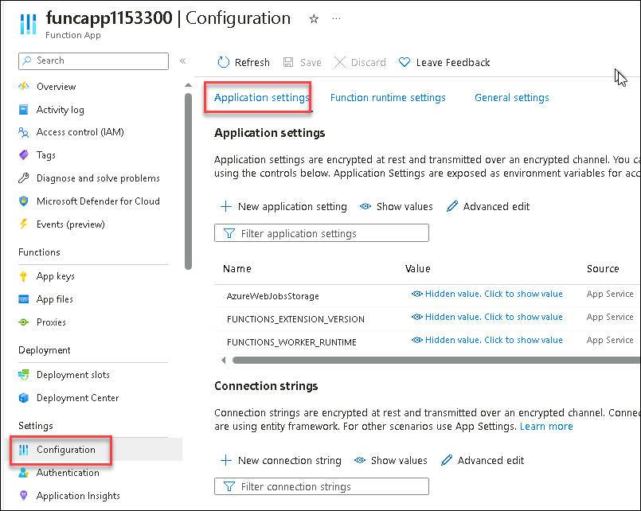

# Call Center data analysis using Azure AI services and Azure OpenAI 

## Overview
In this hands-on lab, you will learn how to effectively extract insights from customer conversations within a call center using Azure AI services and Azure OpenAI Service. You'll get the opportunity to apply real-time and post-call analytics to enhance call center efficiency and elevate customer satisfaction. This immersive experience will guide you through a diverse range of topics related to data processing, audio transcription, sentiment analysis, and data visualization, allowing you to master real-time and post-call analytics.

## Architecture diagram

 

## Getting started

## Instructions

1. Once the environment is provisioned, a **virtual machine** (JumpVM) on the left and a lab guide on the right will get loaded in your browser. Use this virtual machine throughout to perform the lab tasks.

   

2. To get the lab environment details, you can select the **Environment details** tab, you can locate the **Environment details** tab in the upper right corner.
   
   

3. You can also open the Lab Guide on a separate full window by selecting the **Split Window** button on the bottom right corner.
   
4. You can **start(1)** or **stop(2)** the Virtual Machine from the **Resources** tab. You can also monitor the uptime remaining for your VM from here.

   

## Getting started with the Azure Portal

1. In the browser that you already opened, open a new tab, and sign in to the **Azure Portal** (<http://portal.azure.com>).

1. On the **Sign in to Microsoft Azure** blade, you will see a login screen, in which enter the following email/username and then click on **Next**.  

   * **Azure Username/Email**:  <inject key="AzureAdUserEmail"></inject> 
   * **Azure Password**:  <inject key="AzureAdUserPassword"></inject>

        **Note**: Refer to the **Environment Details** tab for any other lab credentials/details.
        
    
  
    
  
1. If you see the pop-up like below, click **Skip for now(14 days until this is required)**.

    

1. If you see the pop-up **Stay Signed in?** click **No**.

    

1. If you see the pop-up **You have free Azure Advisor recommendations!** close the window to continue the lab. 

1. If a **Welcome to Microsoft Azure** popup window appears, click **Maybe Later** to skip the tour.

    

## Task 1 : Create a function App and function using VS Code

1. Search and select the **Function App** from the search bar

   

2. Select **+Create**

   

3. On the **Create Function App** blade select the subscription and the provided resource group

   - Function App Name: funcapp-<inject key="DeploymentID"></inject>
   - Runtime stack : Python
   - Version : 3.11
   - Region : East US
   - Hosting options and plans : App service Plan
   - Pricing Plan: Basic

    

4. Leave the other option set to Default and select **Review+Create**, **Create**

   

5. Once the deployment is successful, Open the created function app and select **Configuration** under **Settings**

   

6. Select **+New application setting** from the **Application settings** tab

   

7. In **Add/Edit application setting**, Add **AzureWebJobsFeatureFlags** under **Name** field and provide its value as **EnableWorkerIndexing** in **Value** field and click **OK**

   

8. Next, Add **AZURE_OPENAI_ENDPOINT** under **Name** field and provide its value in **Value** field and click **OK**

   
   
9. Similarly do it for AZURE_OPENAI_KEY , BlobStorageConnectionString , SqlConnectionString in **Name** fields.

   >Get the values from **Envrionment details** tab of the lab environment page.

11. Ensure all the application settings are aded and click on **Save** to save the settings

    
   
## Task 2: Upload audio file 

## Task 3 : Visualization
